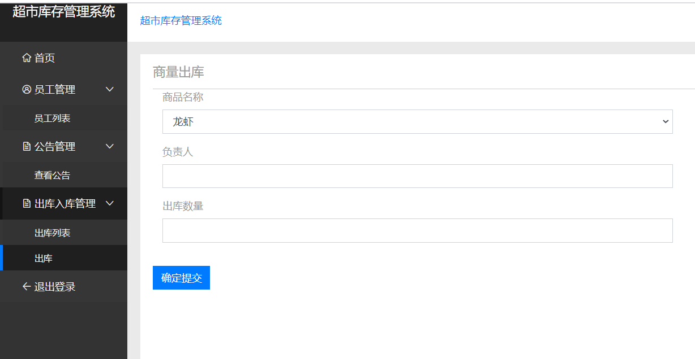
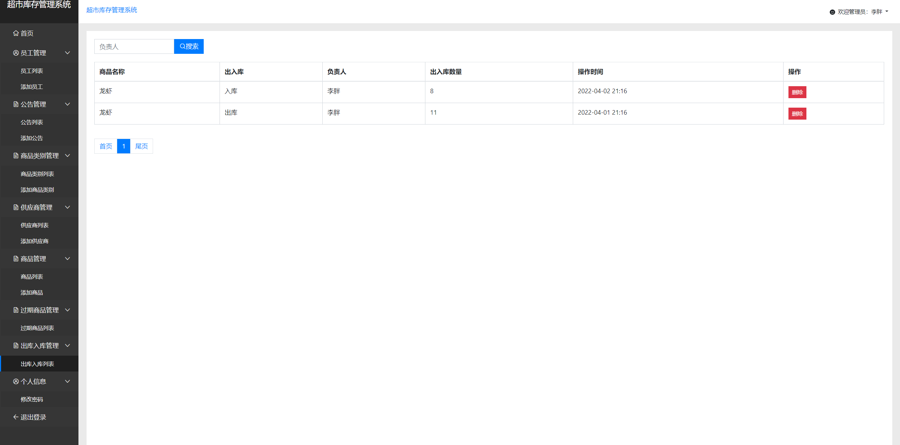
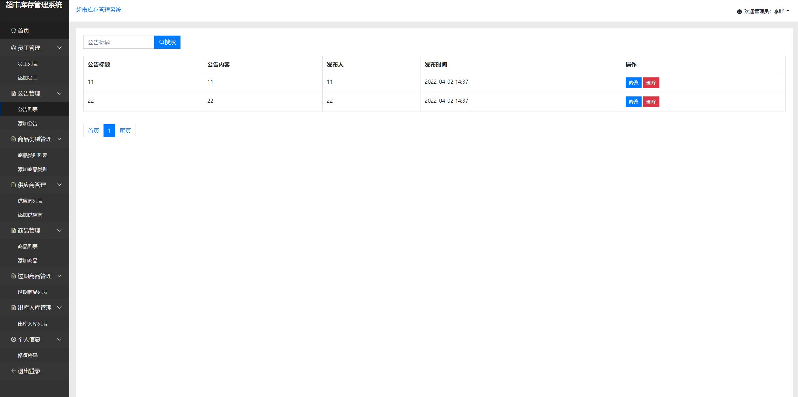
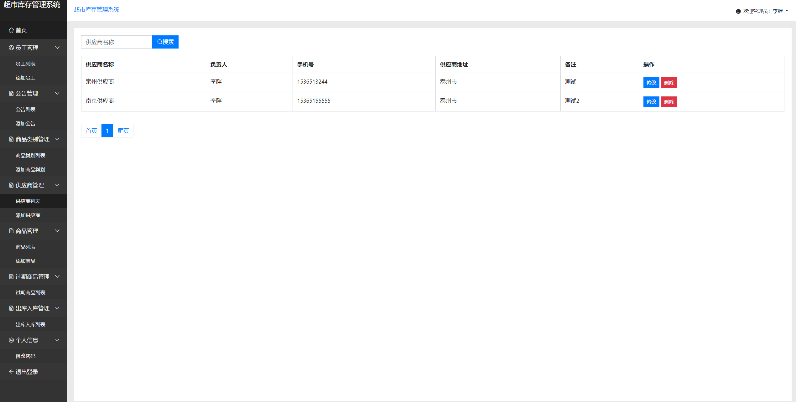
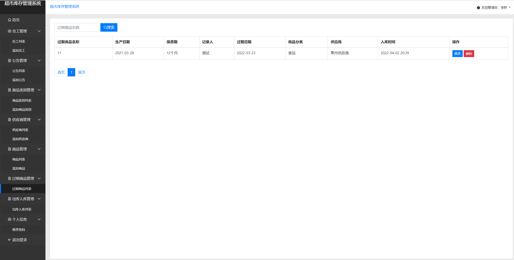
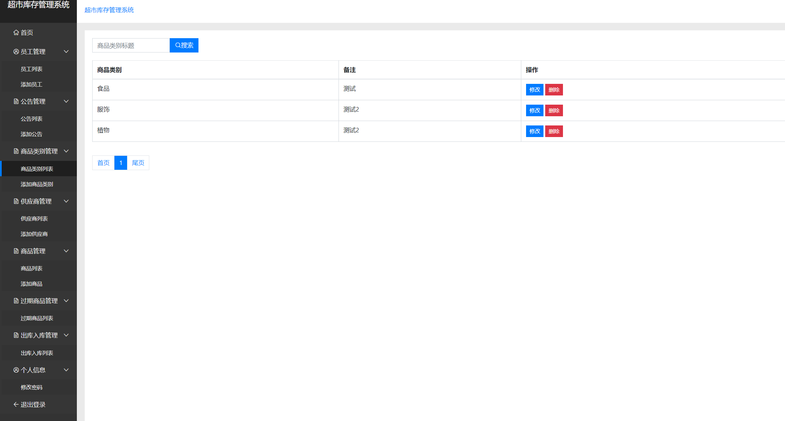
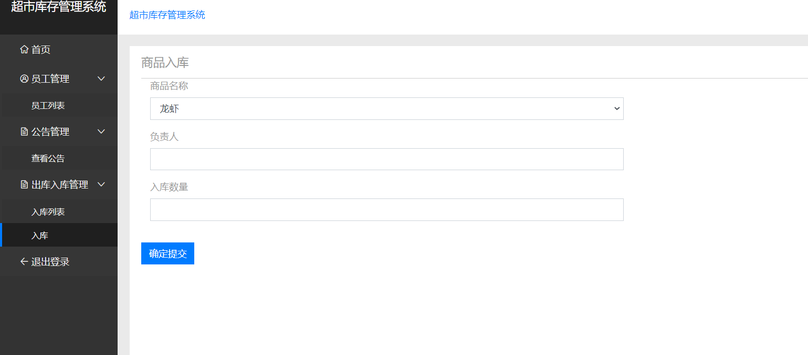
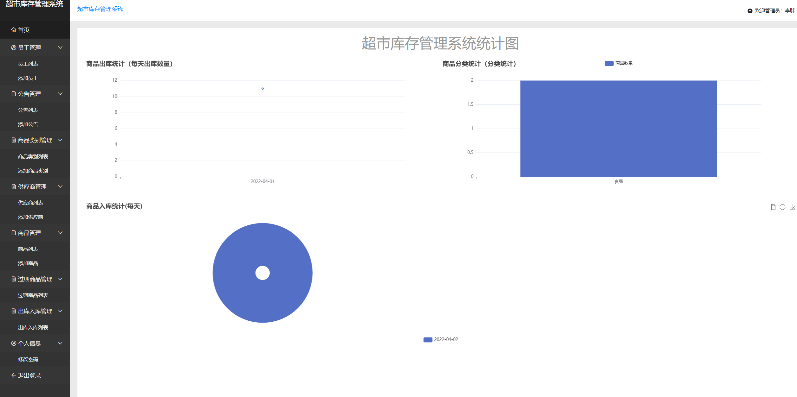
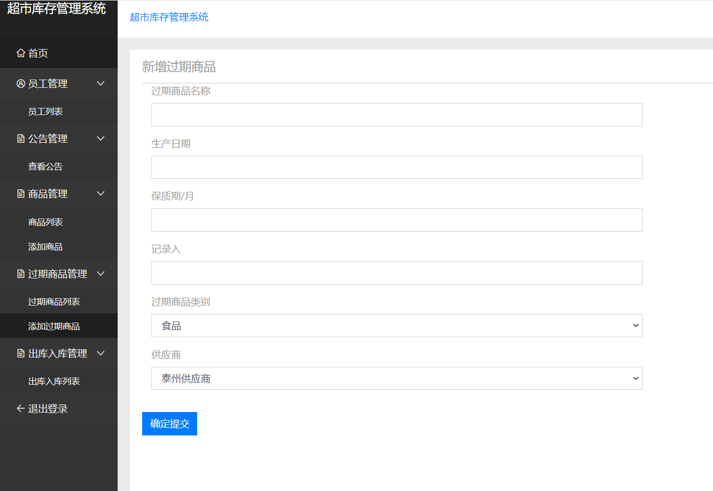

## 基于JSP+Servlet实现的超市库存管理系统

- <b>完整代码获取地址：从戎源码网 ([https://armycodes.com/](https://armycodes.com/))</b>
- <b>技术探讨、资料分享，请加QQ群：692619798</b> 
- <b>作者微信：19941326836  QQ：952045282</b> 
- <b>承接计算机毕业设计、Java毕业设计、Python毕业设计、深度学习、机器学习</b>
- <b>选题+开题报告+任务书+程序定制+安装调试+论文+答辩ppt 一条龙服务</b>
- <b>所有选题地址 ([https://github.com/YuLin-Coder/AllProjectCatalog](https://github.com/YuLin-Coder/AllProjectCatalog)) </b>

## 项目介绍
基于JSP+Servlet实现的超市库存管理系统，主要功能如下

【入库人员】
员工管理：员工列表
公告管理：查看公告
出库入库管理：入库列表，入库

【出库人员】
员工管理：员工列表
公告管理：查看公告
出库入库管理：出库列表，出库

【普通员工】
员工管理：员工列表
公告管理：查看公告
商品管理：商品列表，添加商品
过期商品管理：过期商品列表，添加过期商品
出库入库管理：出库入库列表

【管理员】
首页
员工管理：员工列表，添加员工
公告管理：公告列表，添加公告
商品类别管理：商品类别列表，添加商品类别
供应商管理：供应商列表，添加供应商
商品管理：商品列表，添加商品
过期商品管理：过期商品列表
出库入库管理：出库入库列表
个人信息：修改密码

## 项目技术
- 编程语言：Java
- 数据库：MySQL
- 前端技术：JSP、JavaScript、bootstrap、JQuery
- 后端技术：Servlet、JDBC

## 运行环境
- JDK版本：JDK1.8及以上
- 开发工具：IDEA、Ecplise、Myecplise都可以
- 数据库: MySQL5.7及以上

## 运行截图

